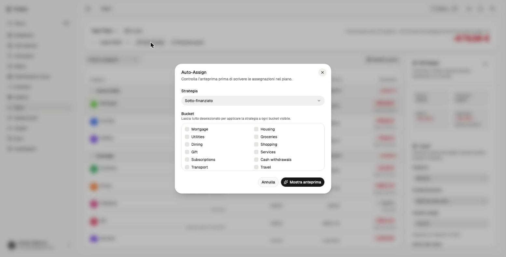

# Tracky

Personal finance tracker: manual and bank-synced accounts, transaction ledger,
zero-based planning, credit facilities, reports, and an AI analyst with an
optional Telegram channel.

Built on [Convex](https://convex.dev/) (database + server logic),
[TanStack Start](https://tanstack.com/start) (React frontend), and
[WorkOS AuthKit](https://authkit.com/) (authentication).



## Features

- Accounts: manual cash/card accounts plus bank sync via
  [Enable Banking](https://enablebanking.com/) (each user connects their own
  Enable Banking app and keys — see [SECURITY.md](SECURITY.md)).
- Ledger: imports, transfers, categories, CSV import, reports.
- Plan: zero-based budgeting with buckets, targets, and auto-assign.
- Credit: facilities, installments, loans, card statements.
- Analyst: Convex-native AI assistant with approval-gated writes, email
  reports, and Telegram delivery (all optional, server-side only).
- Bilingual user docs (EN/IT) in `src/content/user-docs/`.

## Prerequisites

- Node.js 20+ and npm (npm only — `package-lock.json` is the single lockfile).
- A [Convex](https://convex.dev/) account.
- A [WorkOS](https://workos.com/) account (AuthKit).
- Optional: Enable Banking app, Resend key, Telegram bot, AI Gateway key.

## Quickstart

```bash
npm ci
cp .env.local.example .env.local   # then fill in your values
npx convex dev                      # provisions your Convex deployment
npm run dev                         # Vite + Convex in parallel
```

Open [http://localhost:3000](http://localhost:3000).

WorkOS setup: add `http://localhost:3000/callback` as a redirect URI, generate
a 32+ char cookie password, and set `WORKOS_CLIENT_ID` / `WORKOS_API_KEY` both
in `.env.local` and in Convex:

```bash
npx convex env set WORKOS_CLIENT_ID <your_client_id>
npx convex env set WORKOS_API_KEY <your_api_key>
```

Enable Banking (per user, own app and keys):

```bash
npx convex env set ENABLE_BANKING_APP_ID <your_app_id>
npx convex env set ENABLE_BANKING_PRIVATE_KEY <base64_or_escaped_pem>
npx convex env set ENABLE_BANKING_REDIRECT_URL https://<your-deployment>.convex.site/enablebanking/callback
```

Analyst AI / email / Telegram (all optional, Convex env only):

```bash
npx convex env set AI_GATEWAY_API_KEY <key>
npx convex env set RESEND_API_KEY <key>
npx convex env set TELEGRAM_BOT_TOKEN <token>
npx convex env set TELEGRAM_WEBHOOK_SECRET <random_secret_32_chars>
npx convex env set TELEGRAM_WEBHOOK_URL https://<your-deployment>.convex.site/telegram-webhook
npx convex run analyst/telegramActions:registerTelegramWebhook
```

## Security: secrets handling

- Never commit `.env.local` or key material. Production secrets belong in
  Convex encrypted environment variables (`npx convex env set NAME value`).
- `npm install` runs the `prepare` script, which installs a pre-commit hook
  (`githooks/pre-commit`) blocking env files and PEM private-key blocks.
- If the Enable Banking private key is ever exposed, rotate it in the Enable
  Banking control panel immediately. See [SECURITY.md](SECURITY.md).

## Scripts

| Script | Purpose |
| --- | --- |
| `npm run dev` | Vite dev server + Convex |
| `npm run build` | Production build |
| `npm test` | `vitest run` (full suite) |
| `npm run lint` | `tsc` + ESLint, zero warnings |
| `npm run deploy` | Convex deploy + Cloudflare Worker deploy |
| `npm run diagnostics:enable-banking` | Local Enable Banking payload capture (gitignored `diagnostics/`) |

## Project layout

- `convex/` — backend: schema, banking sync, planning, analyst, tests.
- `src/` — TanStack Start frontend, routes, components.
- `src/content/user-docs/` — bilingual user documentation (EN/IT).
- `docs/` — developer docs: `architecture.md`, `deployment.md`, `decisions/`.
- `scripts/` — worktree bootstrap, diagnostics.
- `githooks/` — pre-commit secret guard.

## Docs

- [docs/architecture.md](docs/architecture.md) — domain boundaries and data flow.
- [docs/deployment.md](docs/deployment.md) — Cloudflare Worker + Convex deploy.
- [docs/decisions/](docs/decisions/) — architecture decision records.
- [CONTRIBUTING.md](CONTRIBUTING.md) — dev setup and PR process.
- [SECURITY.md](SECURITY.md) — reporting, key handling, bank-sync disclaimer.

## License

MIT — see [LICENSE](LICENSE). Font: Geist Variable via Fontsource (SIL OFL).

Dependency note: `sharp` (via `@cloudflare/vite-plugin` → miniflare, dev-only)
bundles libvips prebuilds (`@img/sharp-libvips-*`, LGPL-3.0-or-later),
dynamically linked. It is not part of the shipped app bundle.
